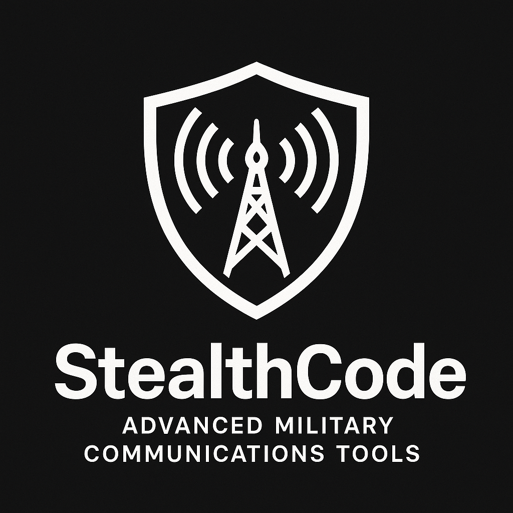
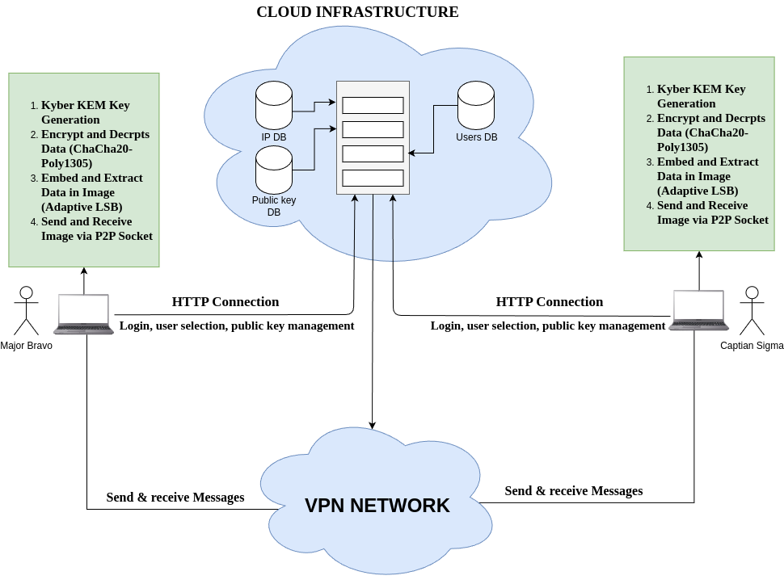

# StealthCode: Advanced Military-Grade Communication Tool

## 📜 Overview

**StealthCode** is an advanced secure communication tool that merges **post-quantum cryptography** with **adaptive image steganography** for ultra-secure, stealthy, and future-proof transmission of sensitive information.  
Designed for critical applications like **military operations**, **government communications**, and **corporate confidentiality**, it ensures data confidentiality, integrity, and authenticity against emerging cyber and quantum threats.

---

## 🛡️ Key Features

- 🔐 **Authentication & VPN Server**  
  Secure user authentication and IP management over a private VPN network.

- 📚 **Quantum-Resistant Encryption**  
  Employs **Kyber Key Encapsulation Mechanism (KEM)** for key exchange and **ChaCha20-Poly1305** for robust, authenticated encryption.

- 🖼️ **Adaptive Image Steganography**  
  Sophisticated least-significant-bit (LSB) embedding techniques hide encrypted data into carrier images while preserving visual integrity.

- 🛁 **Peer-to-Peer Socket Communication**  
  Secure, low-latency file transmission of both encrypted keys (`key.json`) and stego-images over raw sockets after authentication.

- ✅ **Integrity Verification**  
  Ensures complete and unaltered file transmission.

---
## 🔥 How It Works (Data Flow)

1. **Authentication Phase (HTTP)**  
   - User logs into the Authentication Server.
   - Upon success, retrieves list of available receivers and selects one.
   - Receives assigned VPN IP.
   - Public Key registered with Cloud Database.

2. **Secure Messaging Phase (Socket Communication)**  
   - Sender fetches receiver’s Public Key.
   - Message encrypted (ChaCha20), steganographically embedded into an image.
   - `key.json` (containing transmission key and tag) sent first over socket.
   - Then the encrypted stego-image is transmitted via socket.
   - Receiver extracts hidden data, decrypts message using transmission key.

---

## 🛠️ System Architecture



> 🔸 Server communications are HTTP-based.  
> 🔸 Sender-to-Receiver communications are raw Socket-based, secured under VPN.

---

## 📚 Technologies Used

| Component                   | Technology Stack                      |
| ---------------------------- | ------------------------------------- |
| Cryptography                 | Kyber KEM, ChaCha20-Poly1305          |
| Steganography                | Adaptive LSB Substitution             |
| Networking (Direct Transfer) | Python `socket`                       |
| Backend Communication        | Python `requests`, `Flask`            |
| Database                     | SQLite3                               |
| UI                           | Tkinter (for simple UI interface)     |
| VPN Setup                    | WireGuard                             |

---

## 🧰 Project Modules

| Module | Description |
|:---|:---|
| **User Interface Module** | User-friendly secure chat and file exchange frontend. |
| **Cryptographic Module** | Handles key generation, encryption, and decryption. |
| **Steganography Module** | Hides and extracts encrypted data inside images. |
| **Engine Module** | Coordinates between cryptography and steganography. |
| **Networking Module** | Manages peer-to-peer socket communication. |
| **VPN Networking Module** | Connects through a private VPN and communicates with authentication server. |
| **Server Configuration Module** | Handles server setup, user management, and VPN IP allocation. |

---

## 📊 Algorithms Used

- **Kyber Key Encapsulation Mechanism (KEM)**  
  (Post-Quantum secure key exchange)

- **ChaCha20-Poly1305 Cipher**  
  (Authenticated encryption for messages)

- **Adaptive LSB Steganography**  
  (Resilient data hiding technique inside images)

- **HMAC-based Key Derivation Function (HKDF)**  
  (Securely derives transmission keys)

---

## 🚀 Setup Instructions


### Setup and Install liboqs

To install liboqs (the Open Quantum Safe library), follow these steps:

#### Clone the repository:
```shell
git clone --depth=1 https://github.com/open-quantum-safe/liboqs
```

#### Build liboqs:

```shell
cmake -S liboqs -B liboqs/build -DBUILD_SHARED_LIBS=ON
cmake --build liboqs/build --parallel 8
cmake --build liboqs/build --target install
```

Note: On UNIX-like systems, you may need sudo for installation:
```shell
sudo cmake --build liboqs/build --target install
```

4. Set up Environment (if needed)

On UNIX-like platforms (Linux/macOS): You may need to add liboqs's library directory to LD_LIBRARY_PATH (or DYLD_LIBRARY_PATH on macOS):

```shell
    export LD_LIBRARY_PATH=$LD_LIBRARY_PATH:/usr/local/lib
```
On Windows: Add liboqs to your system’s PATH:
```shell
    set PATH=%PATH%;C:\Program Files (x86)\liboqs\bin
```
Alternatively, you can configure liboqs to be installed in a custom directory:

```shell
    cmake -S liboqs -B liboqs/build -DCMAKE_INSTALL_PREFIX=/path/to/liboqs -DBUILD_SHARED_LIBS=ON
```

### Install and activate a Python virtual environment

Execute in a Terminal/Console/Administrator Command Prompt

```shell
python3 -m venv venv
. venv/bin/activate
python3 -m ensurepip --upgrade
```

On Windows, replace the line

```shell
. venv/bin/activate
```

by

```shell
venv\Scripts\activate.bat
```

### Configure and install the wrapper

Execute in a Terminal/Console/Administrator Command Prompt

```shell
git clone --depth=1 https://github.com/open-quantum-safe/liboqs-python
cd liboqs-python
pip install .
```
### Clone the Repository

First, clone the repository for your stealth code and navigate into the directory:

    git clone https://github.com/abhipnair/StealthCode.git
    cd StealthCode


### Server Configuration

Edit user data for the server: Edit the user_data.json file to add or remove users for your server configuration.

#### Run Server Setup: To configure the server:

```shell
cd Server Configurations
sudo python3 server_config.py
```
#### Start Server Listing: To start the server (use sudo if necessary):

    sudo python3 stealthCodeServer.py

#### Uninstall the Server: To uninstall the server, use the provided uninstall.sh script:

    bash uninstall.sh

### User Configuration

For users running the system:
Go into the virtual environment where liboqs is installed.


#### For starting the software execute

    python3 login.py

**Note: Ensure that you are currently using the venv created and at StealthCode directory.**


#### For more information on Open Quantum Safe and to view the official GitHub repositories, you can visit:

    Open Quantum Safe GitHub: https://github.com/open-quantum-safe/liboqs-python/


---

## 🔮 Future Enhancements

- Add more Post-Quantum cryptographic schemes (ex: NTRU, Saber).  
- Expand carrier support to **audio** and **video** files.  
- Implement **cross-platform mobile compatibility**.  
- Use **AI-powered steganalysis defense** against detection tools.

---

## 📜 Conclusion

**StealthCode** offers an innovative, quantum-resilient, and covert communication platform optimized for future military, governmental, and critical applications. Its robust design combines encryption, steganography, and efficient networking into a modular, secure communication system.
## ✍️ Authors

- Made with ❤️ and countless cups of coffee by [@abhipnair](https://github.com/abhipnair)
- Special thanks to [Anjali Suresh](https://github.com/anjali-021suresh) for the amazing support and seamless coordination 🚀

## 📜 License

This project is licensed under a modified MIT License:

---

MIT License (Modified)

Copyright (c) 2025 Abhipnair

Permission is hereby granted, free of charge, to any person obtaining a copy  
of this software and associated documentation files (the "Software"), to deal  
in the Software without restriction, including without limitation the rights  
to use, copy, modify, merge, publish, distribute, sublicense, and/or sell  
copies of the Software, subject to the following conditions:

1. **Author Attribution:**  
   All copies, forks, or substantial uses of the Software must retain clear acknowledgment of the original author: [@abhipnair](https://github.com/abhipnair).

2. **Prohibited Activities:**  
   The Software must not be used for any unlawful, illegal, or unethical activities, including but not limited to unauthorized access, cyber attacks, or any activities violating local or international law.

3. **Acceptance of Terms:**  
   By cloning, forking, copying, or using this Software in any form, you automatically agree to abide by these rules and regulations.

4. **Disclaimer:**  
   THE SOFTWARE IS PROVIDED "AS IS", WITHOUT WARRANTY OF ANY KIND, EXPRESS OR IMPLIED, INCLUDING BUT NOT LIMITED TO THE WARRANTIES OF MERCHANTABILITY, FITNESS FOR A PARTICULAR PURPOSE AND NONINFRINGEMENT. IN NO EVENT SHALL THE AUTHORS OR COPYRIGHT HOLDERS BE LIABLE FOR ANY CLAIM, DAMAGES OR OTHER LIABILITY, WHETHER IN AN ACTION OF CONTRACT, TORT OR OTHERWISE, ARISING FROM, OUT OF OR IN CONNECTION WITH THE SOFTWARE OR THE USE OR OTHER DEALINGS IN THE SOFTWARE.

---


## 📖 References

- [1] Utkarsh Choudhary, Parul Agarwal – Image Steganography Combined with Cryptography.
- [2] Roy, Islam – Hybrid Secured LSB & AES.
- [3] Yang, Sun – Adaptive LSB Substitution for Image Data Hiding.
- [4] Cheddad et al. – Survey of Image Steganography Methods.
- [5] Altigani, Hasan – Polymorphic Advanced Encryption Standard for Data Security.

---

